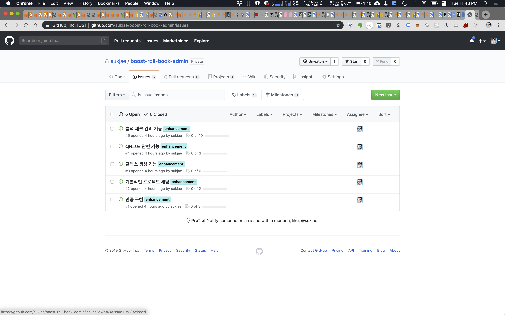
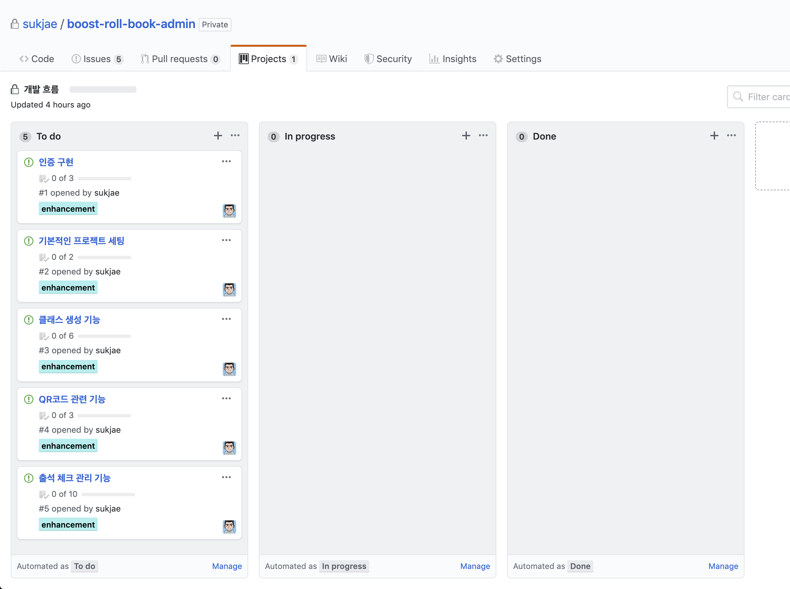

# [부스트캠프 멤버십 1일차]

## 오늘의 학습

### 전반적으로...

어제와 비슷하게 두명의 마스터님들이 오셔서 강의형식으로 진행되었다. 

멤버쉽 과정을 시작하기 앞서 몸풀기 단계의 템포로 진행되었으며, 오늘은 주로 멤버쉽동안 어떻게 프로젝트를 진행하게 될지에 초점이 맞춰졌다. 

이와 더불어, 실제 프로젝트 중에 해야할 코드리뷰, 스크럼 등의 방법들이 주제로 다뤄졌다. 

강의 중간 중간에 짧은 시간동안 코드리뷰와 회고등을 진행할 시간이 있었다. 
하지만 이 시간이 맛보기 형식으로 진행되어 그 의미를 느끼기에는 부족하였던것 같다. 
프로젝트를 진행하며 그 의미와 필요를 찾아가야겠다. 

한정된 시간속에서 애자일과 스크럼, 그리고 코드리뷰의 가치등을 훑기에는 부족한 시간이였을 것이다. 
그러나, 하나하나 중요한 주제 이므로, 이번 강의는 길을 밝혀주는 정도로 생각하고 자세한 부분은 스스로 찾아보도록 해야겠다. 

## 오늘의 배움

스크럼에 대해 다루면서 체크리스트에 대한 내용이 나왔다. 

중요함을 알고있었지만, 지금 내가 하고 있는 코드에 적용을 하고 있지 않은 나의 상황이 문득 떠올랐다.

출석 관리 서비스를 개발하며 모든 내용이 혼자만의 머릿속에 있으니, 규칙없이 옛날처럼 마구자비로 개발을 하고 있엇다. 
또 한정된 시간안에 개발해야 한다는 압박감에 코드의 품질에 타협을 봤던것 같다. 

이에 반성하고, 강의 시간이 끝난 뒤 나의 세부 프로젝트 별로 간단하게 기능과 체크리스트를 작성하였다. 
너무 복잡하지 않고 린하게 가기 위해 모든 체크 포인트는 GITHUB의 issue와 PR그리고 Project를 사용하기로 결정하였다. (처음엔 지라를 사용할까 하였지만.... 배보다 배꼽이 커지는 상황이 오므로 린하게 가기로 마음먹었다.)

항상 느끼는 것 이지만, 내가 아는 내용일지라도 그 속에서 께닳음을 얻을 수 있는것 같다. 
좋은 사람, 좋은 주제의 이야기들은 아무리 알고 있더라도 흘려 듣지 말고 깊이 생각해보면 크게 도움이 될것이다. 

## 영감을 준 말들

- 회고를 회고하는 작업도 있을 수 있다. 
- 회사의 코드 공개 범위가 궁금하면, 기업들의 기술 블로그를 분석해 보아라. 

## 첨부

> ~체크리스트를 추가한 Github Issue 페이지~

> ~Issue 를 기반으로 관릭 가능한 Todo 리스트(Github Project)~