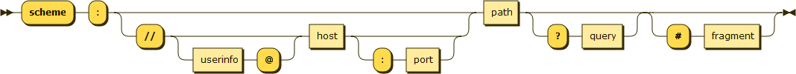

# day-19

# [부스트캠프 19일차]

## 피어 세션 중 생각 정리

### [작업(주문)의 분배]

- Web worker를 통한 구현에서는 주문에 대해 단순히 FIFO를 통하여 뽑아 처리 하였다.
- 이번에는, 하나의 주문 흐름(FIFO큐)에서, 각각의 메뉴별 흐름(FIFO큐) 로 분기하고,
- 각각의 메뉴를 한번씩 순회하며 뽑아 처리하였다.
- 하나의 메뉴로 몰리는 주문의 경우(예, A씨가 아메리카노 100잔, B씨가 카푸치노 1잔)
    - 기존의 방식이 A씨에게만 최고의 만족감을 주는 것 이였다면
    - 이번 구현 방법은 A씨, B씨 모두에게 만족감을 줄 수 있다

### [음료의 종료를 아는 주체는 누구일까]

- 미션에서는 고객의 모든 주문 처리시, 매니저가 받아서 대쉬보드를 갱신하는 방식으로 제시 하였다.
- 나의 경우는 실제 카페를 생각하여 구현하였다.
    - 실제 카페에서는, 바리스타가 매 조리 완료시 마다 매니저한테 일일이 보고하고, 매니저가 일의 종료를 파악하여 대시보드를 갱신하는 시스템일까?
    - 아니면, 바리스타가 매 조리 완료시 마다 대시보드를 갱신하고, 대시보드가 종료를 판단할까?
- 나는 후자라 보았다. 나의 구현에서는 바리스타의 조리가 끝나면, 대시보드에 이벤트를 발생하고, 대시보드는 해당 고객의 전체 음료수 수(CheckQueueu.working)를 참조하여, 특정 고객의 음료수가 들어올때 마다 1씩 가감한다.
- 특정 고객의 전체 잔여 음료수 수 가 0 이 되면, 대쉬보드는 주문이 완료되었음을 알린다.

### [재 사용 되는 요소들은 따로 클래스로]

- 지난 과정동안 클래스는 최대한 사용하지 않으려 하였다. 대부분 함수로도 가능하였고, 함수형으로 작성하고자 하였다
- 이번 미션에서는 따로 별도의 DB가 존재하지 않았고, 하나의 객체를 데이터 저장소로서 활용해야 했기 떄문에 순수 함수로는 힘들다여겨 클래스를 사용하였다.
- 특히, 서로다른 queue가 7개 생성되는데, 비슷한 기능을 제공하는 큐가 반복되었으면, 코드가 굉장히 복잡해졌을 것이다.
- 각각의 큐를 queueManagement에서 생성, 관리 하여 사용하였다.

## 챌린지 중 느낀것

### **[URL의 구성 요소에 대한 이해]**

통신에 대한 과제가 주어졌고, URL에 대한 이해가 필요해서 자료를 조사하였다. 

시간이 한정적이기 때문에 많은 내용을 이해하지는 못했지만, 몇가지 흥미로운 부분들이 보였다. 

첫째로, 우리가 자주 사용하는 URL의 구조와 달리 실제 구조에는 몇가지 구성요소가 더 있다. 

예를 들어, 나는 다음 표에서 protocol + host + path 정도만 사용하고 알고 있었다 .

그런데 오늘 다음 자료를 보며 이와 더불어 auth와 hash가 있음을 알게 되었다.

[[NodeJS URL]](https://nodejs.org/api/url.html)

[[whatwg]](https://url.spec.whatwg.org/)

항상 url을 브라우저에 입력함에도 불구하고 이것이 어떻게 파싱 되는지에 대한 구체적인 고민이 없었는데, 오늘 이를 한번 돌아보게 하는 경험이였다. 

### [시간 분배의 실패]

오늘은 TDD로 처음부터 끝까지 진행하고자 하였다. 어제와 같이 주요 기능별로(URL, HTTP, NET, DNS) 모듈화를 하고 각각의 테스트를 작성하고자 하였다. 

원하는데로 각각의 구성요소에 대한 테스트를 잘 작성 하였는데, 문제는 이것이 시간이 너무 오래 걸렸다는 점이다. 

TDD의 방식대로, 실패하는 코드를 짜고 그린 라이트를 만들어 가며 URL구조를 만들며 이해를 하였는데, 생각보다 시간이 너무 걸려서 6시 정도 에 URL기능 하나가 완성되었다. 

또, 중간에 하나의 체크리스트에서 막혔는데, 그 부분이 계속 막히면 잠시 중단하고 다음 부분을 구현한 뒤에 다시 돌아 왔어야 했는데, 미련하게 그 한 부분만 2시간을 더 잡아 먹은 것 같다. 

나머지 1시간동안 열심히 코딩을 하였지만, 나머지 체크리스트를 모두 채우기에는 역부족이였고, 오늘은 나의 완벽한 패배였다. 

### [아무리 급해도 돌아갔어야...]

오늘 위에서 2시간 동안 헤맨 문제는 사실 단순한 문제였다.

HTTP Request를 보내는데, 끝에 개행이 들어가야 한다. 

나는 이 부분에 대해 자각하지 않고, 어떨때는 넣었다가, 또 어떨때는 안 넣어서 프로그램의 결과가 계속 변했다. 

여기서 나는 나의 Request를 작성하는 부분에서 문제가 있을거란 생각을 못하고 계속해서 Node관련한 문서만 훑었다. 

내가 어디선가 예제를 잘못 복사한건 아닌지, 잘못된 메소드를 사용하는건 아닌지 한참 해맸던것 같다. 

물론, 내가 Node에 대해 많이 이해하지 못하고 있었기 때문일수도 있다. 

하지만, Http request header에 대한 규칙을 꼼꼼히 읽어 봤어도, 이 문제는 쉽게 캐치할 수 있었는데 아쉽다. 

오늘은 너무 구현에만 마음이 앞서다가, 아무것도 하지 못하였다. 

### [URL 모듈을 만드는데 크게 도움이 된 두가지 그림]

    ┌────────────────────────────────────────────────────────────────────────────────────────────────┐
    │                                              href                                              │
    ├──────────┬──┬─────────────────────┬────────────────────────┬───────────────────────────┬───────┤
    │ protocol │  │        auth         │          host          │           path            │ hash  │
    │          │  │                     ├─────────────────┬──────┼──────────┬────────────────┤       │
    │          │  │                     │    hostname     │ port │ pathname │     search     │       │
    │          │  │                     │                 │      │          ├─┬──────────────┤       │
    │          │  │                     │                 │      │          │ │    query     │       │
    "  https:   //    user   :   pass   @ sub.example.com : 8080   /p/a/t/h  ?  query=string   #hash "
    │          │  │          │          │    hostname     │ port │          │                │       │
    │          │  │          │          ├─────────────────┴──────┤          │                │       │
    │ protocol │  │ username │ password │          host          │          │                │       │
    ├──────────┴──┼──────────┴──────────┼────────────────────────┤          │                │       │
    │   origin    │                     │         origin         │ pathname │     search     │ hash  │
    ├─────────────┴─────────────────────┴────────────────────────┴──────────┴────────────────┴───────┤
    │                                              href                                              │
    └────────────────────────────────────────────────────────────────────────────────────────────────┘
    (all spaces in the "" line should be ignored — they are purely for formatting)

출처: [https://nodejs.org/api/url.html](https://nodejs.org/api/url.html)

출처:[https://en.wikipedia.org/wiki/URL](https://en.wikipedia.org/wiki/URL)

첫번째 표는, URL의 구성요소를 파악하는데 큰 도움이 되었다. 

두번째 그림은, 어떻게 URL을 쪼갤 수 있을지 그 순서에 대해 큰 영감을 주었다. 

## 회고

만족스럽지 못한 하루였다. 

항상 끝이 중요한 것인데, 나는 오늘 마지막에 너무 느슨해 졌다. 

특히 오늘 지각을 하였는데, 팀원에게도 죄송하고, 내 자신에게도 너무 실망하였다.

게다가 오늘 구현해야 하는 목표치를 달성하지 못한였고, 너무 아쉬웠다. 

오늘은 다시한번 반성을 하게되는 하루다. 

내일은 더 분발하고 두배로 노력하여 잘 마무리 짓도록 하겠다.
