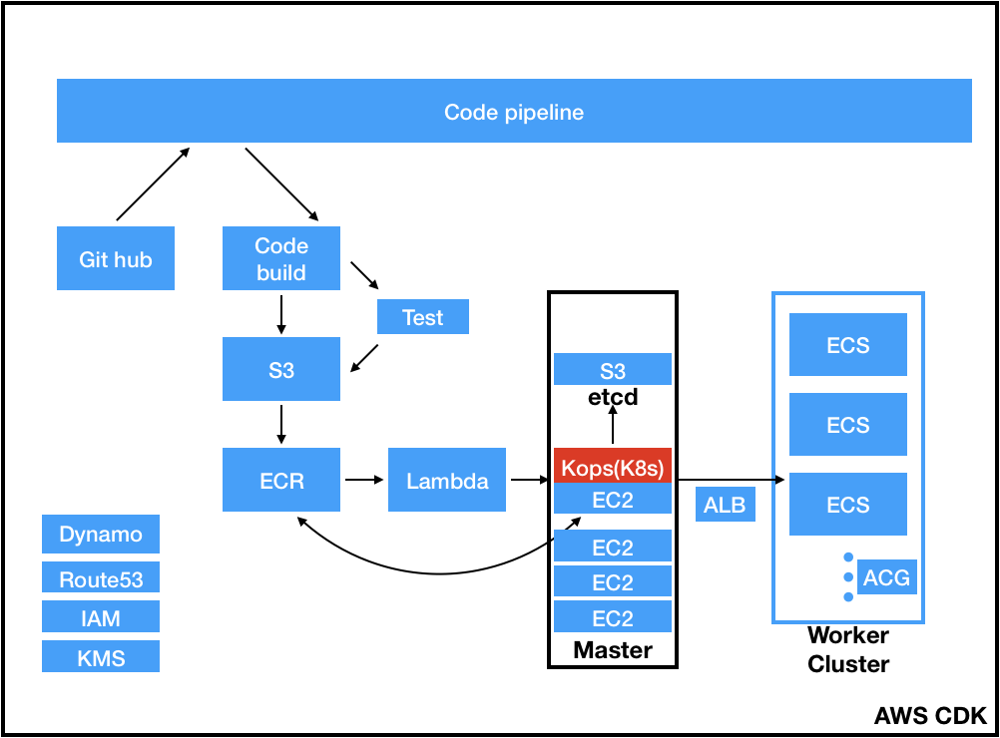

## Kubernetes 삽질기 2

## 구상중인 k8s + AWS 인프라 구성 v1

## 햇갈리는 부분 정리

## K8s에 쓰일 docker image는 어느 레벨까지 dockerlize가 되어야 할까

드는 생각들은, os위에 node, 그리고 그 위에 Express App이 올라가게 된다.

이 과정에서 우리는

1. node 까지의 서버를 dockerlize할 수 있고,
2. express app까지 모두 dockerlize할 수 있다.

둘간의 장단점이 보이기는 하지만, 어떤 선택지가 최적인지는 감이 오지 않는다.

1번 방식의 경우에는, os/node 의 버전이 업그레이드 되거나, 설치해야 할 도구들이 있을 경우만 image가 빌드되는 형태로 생각된다. 그 이후 express app은 aws의 EFS과 같은 방식으로 하나의 폴더를 여러 instance가 공유하거나, s3에서 ebs로 하나씩 옮겨서(copy) 서비스 하는 방식이 떠오른다. 어차피, 운영중에 사용자에 의해 서비스의 코드가 변하지 않을 것이다.

예상되는 장단점은 다음과 같다

장점

- image build를 매번할 필요가 없다
- production과 dev(local) 환경의 통일이 용이할듯 하다

단점

- 두가지 환경을 모두 관리해야 한다. 1) image 저장소, 2) 소스 코드 저장소
- 배포에 부가적인 작업이 동반된다 (복사, 등)

두 방법중에, 1번 방법이 현재로 나에게 가장 적합한듯한 이유는, dev환경에서의 k8s & docker 를 이용한 서비스 개발이 어떻게 진행되어야 하는지 감이 안오기 때문이다.

production의 상황에서는 k8s가 build된 image를 pull해서 인프라를 구성하는데, local dev 환경에서 해당 k8s 파일로 provision하면, 최신 image만 사용되기 때문에 추가적으로 해당 image를 수정하기 위해 어떤 작업이 동반되어야 하는지 감이 안온다.

어떤 image를 수정하기 위해서는 우리가 local에서 개발하는 경험처럼 source code를 바꾸고 실행시키는 빠른 feedback이 필요한데 보통의 k8s의 경우에는 source code 변경 → image build → image push → image pull → provision의 과정이 매번 동반될 것 같기 때문이다. 우리가 local에서 hot reload와 같은 방식이 어려워지게 되고, 이는 개발 경험에 치명적인 영향을 끼칠것이다. (express app에 대한 소스코드가 살짝만 바뀌어도, 위 작업이 모두 동반되어야 하므로....)

가장 이상적인 환경은, express까지 image화 하여 k8s에서는 ECR에서 받아 provision만 하면 되는 상황일 것이다.
이 프로세스는 원격에서는 어느정도 잡혀져 있지만, 로컬에서는 어떻게 되어야 하는지 알아보는 중이다.

⇒ 이 부분에 대해 현재는 2번의 방법을 유지하면서 minikube + `eval $(minikube docker-env)` 조합으로 알아보고 있는 중이다. 이 방법을 사용하게 되면, 원격의 이미지 저장소로 push pull 과정 없이 local에서 build한 image를 k8s에서 그대로 사용할 수 있을것으로 기대된다.
