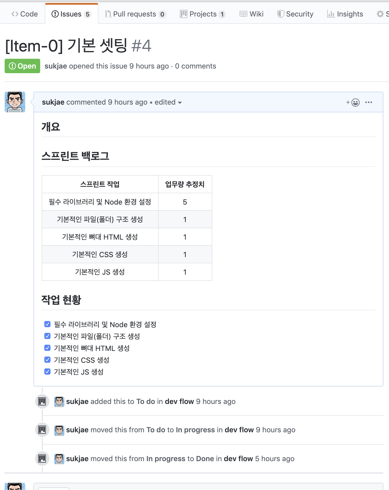

## 오늘의 학습

### 전반적으로...

이번주 내내 컨디션이 좋지 않다.
오늘은 감기까지 걸린듯 하여, 과제에 집중을 하질 못했다.

컨디션을 회복하기 위해서 너무 성급하고 부담되는 페이스로 개발하기 보다는, 느슨하고 여유롭게 개발하였다.

오늘 한 작업들도 어제의 작업의 연장선으로서 폴더와 파일의 구조를 짜는데 시간을 사용하였다.

웹팩을 사용하여 여러 JS 파일(모듈화 된)들과 CSS, 그리고 HTML 파일들을 번들링 하고, 이를 라이브 리로딩 가능하게 구성하였다.

그 후에는 react의 느낌이 나게 HOC를 이용하여 무언가 재사용이 가능한 컴포넌트를 만들어 보려 노력하였다.

대충 구현은 되었지만, 더 많은 고민이 필요할듯 하다.

개발 외에도 스크럼과 칸반을 이해하려 노력하였다.
스크럼에서의 epic과 user story를 작성하는 방법, 그리고 이 스토리에서 어떻게 세부 테스크를 나누는지 찾아봤다.

오늘까지만 여유를 부리고, 컨디션을 회복하여 내일 더 열정적으로 개발을 해야 겠다. (이번주 내에 회복되면 좋겠다.)

## 오늘의 배움

아직도 스크럼에 대한 명확한 실행 방안을 모르겠다.

특히 오늘 내가 가장 궁금했던 부분은

유저 스토리로 구성된 덩어리(에픽에서 잘려 나왔지만, 그래도 여전히 큰 덩어리이다.)를 바탕으로 어떻게 개발자의 기능 명세서가 작성되는 지 였다.

개발자의 기능 명세서를 유저 스토리에 포함해야 하는지,

아니면 개발자가 명세서를 작성하여 BDD, TDD등을 활용하여 지지고 볶으며 개발하는 건지....

그런데, 계속 찾아볼수록 획일화된 규칙이 존재하지 않는 방법론이라는 느낌이 강하게 든다.

지금까지 받은 느낌으로 스크럼은, 그 정신과 철학을 바탕으로 각각의 팀이 상황에 맞게 조절해 가며 사용하는 프레임워크인듯 하다.

즉, 전반적인 방향(에픽, 유저스토리, 스토리보드, 스크럼 마스터, PO등등)은 유지하되, 그 안에서 어떻게 작업을 나누고 소요시간을 계산하는지 등등은 각각의 팀의 결론에 맡기는것 같다.

위에서 고민한 `user story`-> `개발자의 기능 명세서`(체크박스) 로의 전환은 결국 팀의 선택에 맡기는 문제인것 같다.

그래서 나는 하나의 큰(사실 에픽이 큰거고, 이건 중간 사이즈)의 User story 내부에 스프린트 백로그 라는것을 넣어서 세부적으로 기능 명세서를 포함하는 형태로 가져갔다.

그리고, 작업현황을 체크박스로 두어 Github의 Project에 반영되도록 하였다.

> _구조 예시_

## 회고

컨디션이 좋지 않다.

하지만, 컨디션을 조절하고 유지하는것 또한 실력인듯하다.

지금 내가 하고자 하는 일이 단거리 전력질주가 아닌, 장거리 마라톤임을 기억하고 체력 분배를 잘 하도록 하자.
