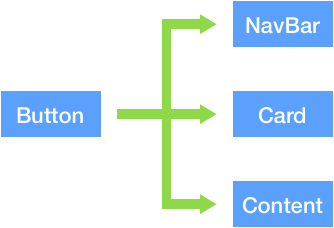
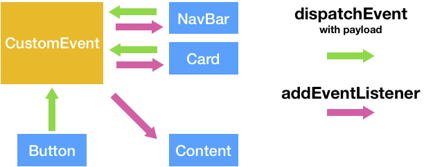

## 오늘 고민한것

### 복잡한 관계에서 어떻게 상호 작용 할것인가.

이번 과제에서 하나의 중심이 되는 값이 존재하고(보통 현재의 인덱스의 위치), 이 값에 다수의 방법으로 변화를 줄 수 있다.

여기까지는 간단한데, 문제는 이 하나의 중심값이 변화가 되면, 그와 동시에 다수의 view에 변화가 생긴다.

React와 같은 단방향 흐름에서는 데이터(state)에 변화를 주면 이에 맞추어 화면(view)가 다시 랜더링 된다.

그러나 vanilaJS 다른 특별한 무언가를 설정하지 않는 이상 이러한 sync한 변화는 이루어 지지 않는다.

그래서 이러한 값의 변화에 따른 동시 다발적인 화면 갱신을 수행하기 위해서 두가지 방법을 생각해볼 수 있는데, push와 pull인것 같다.

### 일단 push방법은 가장 직관적이고 구현이 간단하다.

쉽게 생각해서 button 을 클릭하였을 때 이에 대한결과로 값을 갱신하고, 동시에 화면을 수정하는 것이다.

vanilaJS에서 보통은 button에 addEventListener를 걸어준 다음에, 화면을 갱신할 것이다.

```js
buttonEle.addEventListener("click", e => {
  someRootIndex += 1
  document.getElementById("navbar").style.background = "red"
  document.getElementById("card").style.background = "green"
  document.getElementById("content").style.background = "blue"
})
```

이를 그림으로 그리면 이러한 흐름이다.



그러나 여기서 문제는, 중심이 되는 값(someRootIndex)를 갱신하는 작업이 button뿐만 아니라 기타 다른 엘리먼트와의 인터렉션을 통해 생기는 경우 코드의 엄청난 중복이 생겨버린다. (코드를 넣지 않아도 느껴질것이라 생각한다)


그러나 이러한 방식의 가장 큰 문제는 코드의 중복이 아닌 재사용성이 꽝이 된다는 점이다.

이 상황에만 사용할 수 있도록 코드가 상황에 종속되고, coupling되어 함수 내부 값을 바꾸지 않는 이상 재사용이 너무 어려워 지며, 이는 이전 과제에서 느꼈던 부분이다.

### 다른 방법은 없을까? ⇒Event & Pull!!

두번째로 든 생각은 Observer방식이나 Event를 사용하여 값의 갱신과 화면의 변화를 분리하고, 이를 React처럼 단방향으로 갱신이 가능하도록 하는 방법이 없을까 하다 떠올랐다.

사실, JS나 Node를 쓰는 상황에서 너무나 당연한 접근 방법이였는데, 이벤트 기반 처리에 익숙치 않아 바로 떠오르지는 않았다.

아래와 같은 방식으로 CustomEvent를 생성하여 관리하면 더욱 편리할 것으로 기대 된다. .



이렇게 구성하면, 위의 예시에서 `someRootIndex` 를 갱신하는 작업이 이루어지고, 이후에 Event를 Dispatch 함으로서 해당 Event에 등록된 모든 엘리먼트들이 동시 다발적으로 변화(우리의 예시에서는 배경색 바꾸는 작업)가 실행이 가능해진다.

이 접근 방법의 핵심은, 중심값을 갱신하는 작업과, 화면의 갱신이라는 두개의 큰 작업을 논리적으로 분리할 수 있다. 또한 결합을 줄임으로서 추후에 추가적인 작업(예를 들어 새로운 엘리먼트의 갱신)이 필요할때 적용이 용이하다.

아직 이 방법으로 코드를 작성하지 않아서 어떤 어려움이 있을진 모르겠다.

이 생각으로 코드를 작성한 뒤, 기록을 남기도록 하겠다.

## 마스터 클래스 정리

### promise는 무엇을 반환하는가?

- 팬딩중인 프로미스를 반환한다.

### then은 언제 실행되는가

- then의 줄을 접하는 순간 실행된다.
- 여기서 중요한 부분은, then이 promise가 resolve되기를 기다렸다가 실행되는게 아니라,
- 먼저 실행 되고 나서 then에 넘긴 callback이 promise가 resolve되면 실행되는 형태이다.

### then을 연속적으로 사용가능한 이유가 무엇인가

- then 의 반환값은 Promise이기 때문에 .then으로 체이닝이 가능하다

### setTimeout에서 16.66ms의 의미는?

- VSync 즉 모니터의 화면 갱신은 보통 60Hz이며, 다시말해 1000초에 60번 갱신되서 그 interval은 16.66ms(1000/60)이다.

- 이를 맞추어 스무스 하게 화면을 보여주기 위한 트릭이다.

## 오늘 느낀것

### prototype과 **proto**에 대해 다 까먹고 있었다...

다시 정리하고, 기록하자... 너무 중요한 내용을 너무 쉽게 잊어버렸다.

### Iterm2는 강력하고 아름답다

오늘 iterm의 터미널 화면에 변화를 주었다.

심심했던 나의 화면이 아름답게 변화를 하니 코드를 칠 맛이 나는 것 같다.

지난번에 마스터 님께서 주기적으로 view를 바꾸시던데, 오래 작업하기 위해서 이런 소소한 변화를 주는것도 좋은 방법인것 같다.

화면 예시


적용 방법: [https://gist.github.com/kevin-smets/8568070](https://gist.github.com/kevin-smets/8568070)

## 오늘의 회고

요즘 계속 10분씩 늦는다...

팀원분들께 늦어서 죄송하다, 먼저 시작하시라 하는게 입버릇이 되버리는것 같다.

나의 나태해진 모습을 반성하고, 내일부터 30분 일찍 캠프를 가도록 하자.
