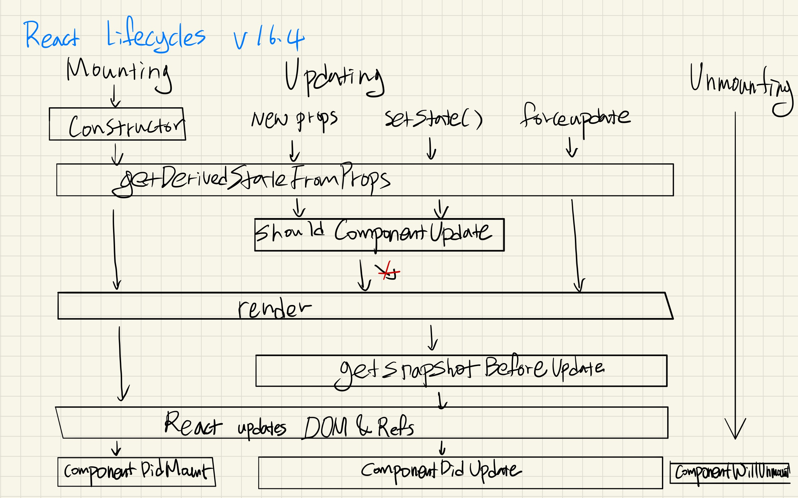
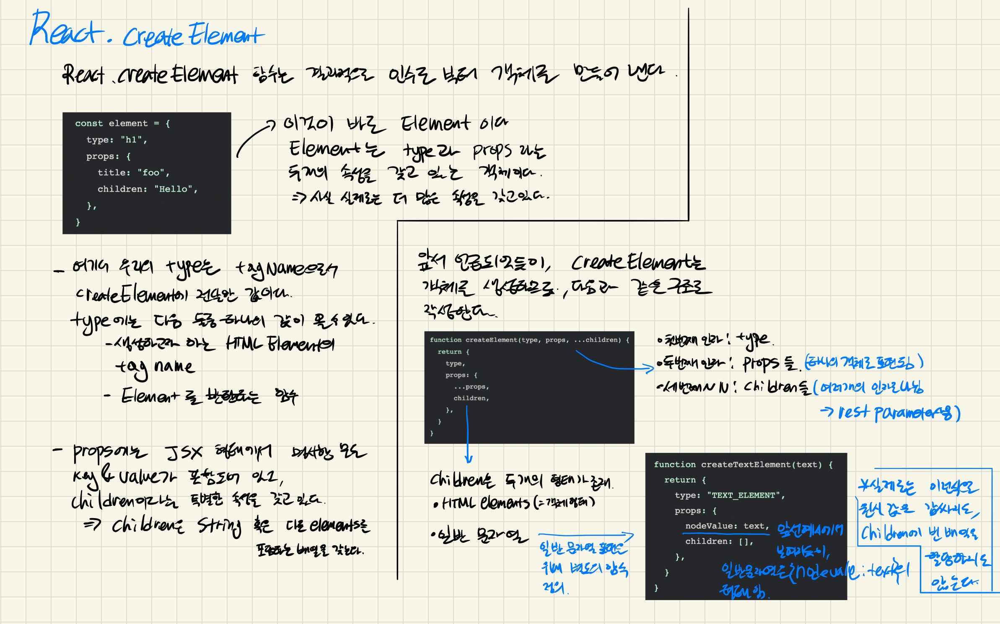
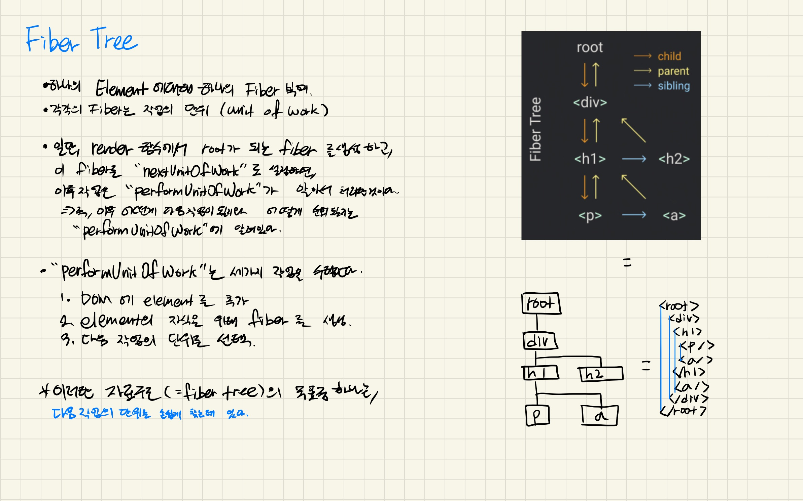
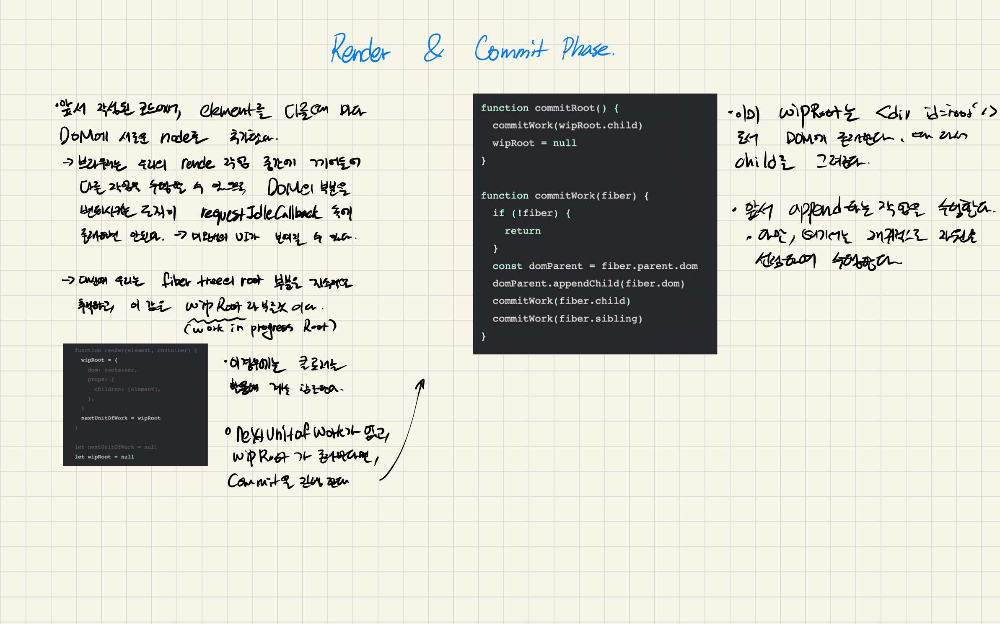

## 요약

[build your own x](https://github.com/danistefanovic/build-your-own-x) 정신에 따라, 만들지 못한다면 이해하지 못한 것 이라는 가정을 갖고 React 를 만들기 위해 학습합니다. 
React를 모방하여 만들기 전에 선배 개발자 님들이 모방한 작업물들을 참조하고, 그 과정에서 얻어진 학습 내용을 수기로 작성하였습니다. 
추후 학습이 깊어저 어느정도 이해가 되면 저만의 React를 만드는 것을 목표로 합니다. 

### 학습 자료: https://pomb.us/build-your-own-react/

> 현재 위 문서에 대한 한글 번역을 완료 하였습니다. 
> 추후 수정후에 저자에게 허락을 받아 공개 할 예정입니다.

### 라이프 사이클

### Virtual DOM 순회 비교

### React.createElement

### ReactDOM.render

### Concurrent Mode 

### Fiber Tree 1

### Fiber Tree 2

### Render & commit phase

### Reconciliation

