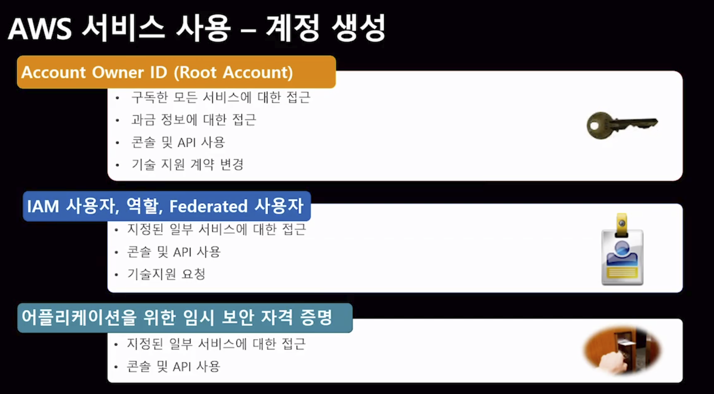
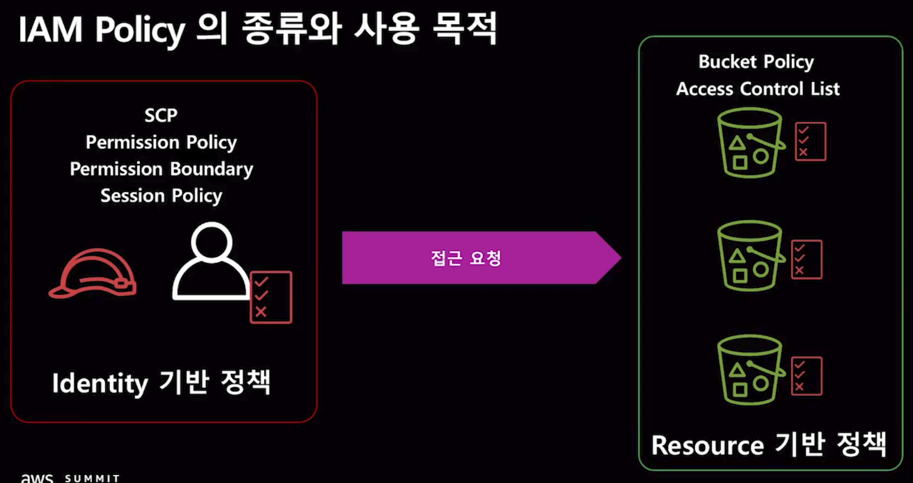
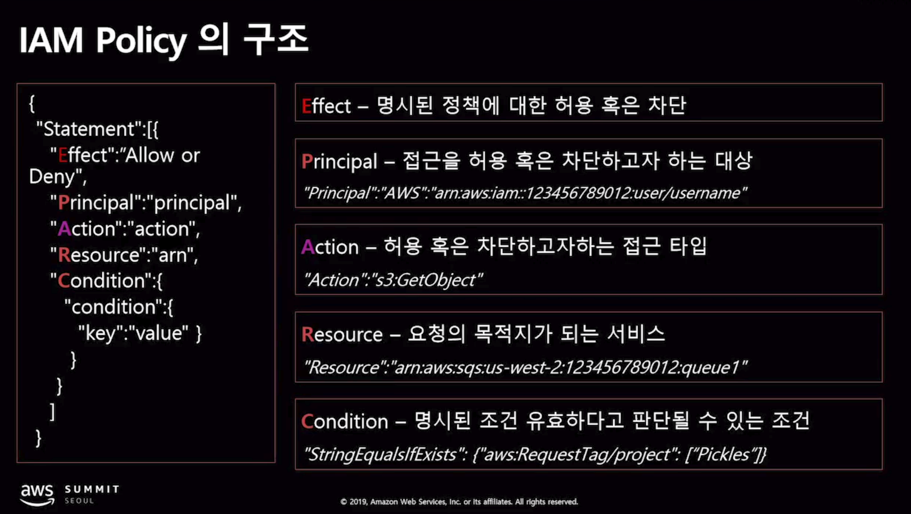
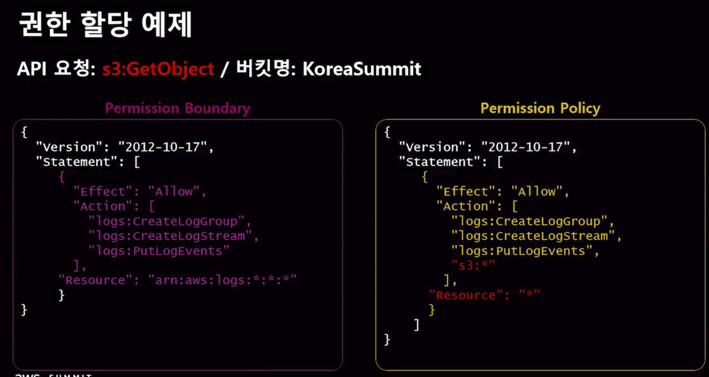
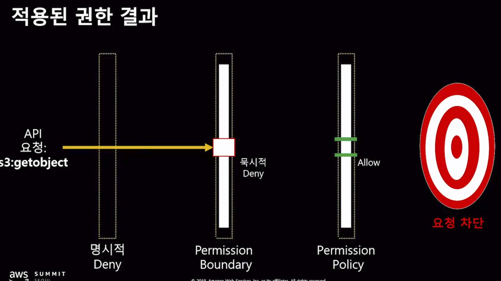

| 발표명 | IAM 정책을 잘 알아야 AWS 보안도 쉬워진다. 이것은 꼭 알고 가자! |
| --- | ---------------------------------------- |
| 발표자 | 신은수 솔루션즈 아키텍트(AWS)                       |
| 출처  | https://youtu.be/iPKaylieTV8             |

오늘은 AWS의 IAM인증에 대해 다시 한번 정리해 보았다. 정리를 하며 좋은 강의(발표)가 있어서, 내용중 일부분을 정리하고자 한다. 

발표는 2019 AWS Summit Seoul에서 진행되었다. IAM에 대한 기본적인 설명(메카니즘)과 활용방법(팁)들이 포함되어 있다. 

### 계정 생성

AWS의 서비스를 사용하기 위해 다음과 같은 종류가 존재한다. 

여기서, IAM 사용자를 ID/PW와 같은 방법으로 접근하는 방식은 Permanent한 자격 증명이다. 반면, 임시보완 자격 증명의 방식은 Lifetime을 갖게 되고 결과적으로 보안에 이점이 생긴다. 

### 서비스 이용 방법

AWS의 서비스를 이용하는 방법은 다음과 같이 low에서 high로 다양한 방법이 존재한다. 

이 중 Declarative한 방식은 자주 사용되는 Provisioning tool들을 뜻하고, CloudFormation, Terraform등이 존재한다. 

### SigV4 

AWS의 서비스를 사용하기 위해서는 SigV4를 사용하여 Signature를 생성한뒤 요청시에 포함해야 한다. 포함은 Header나 query등 다양한 곳에 위치할 수 있다. 

CLI나 CDK같은 도구를 사용시에는 자동으로 매 요청마다 포함되므로 생각할 필요는 없지만, 이와 같은 도구 없이 서비스를 만드는 경우를 위하여 Signature를 만드는 방법이 AWS에 소개되어 있다. 

### IAM Policy

> Policy를 정의할 때는 어떤 IAM Principal이 어떤 Condition에서 AWS의 어떤 Resource에 대해 어떤 Action을 허용/차단 할것인지를 지정한다. 

### IAM Policy의 종류와 사용 목적

다음과 같이 크게 두 분류의 정책이 존재한다. 하나는 사용하는 쪽에 정책을 정의하는 것이고, 다른 하나는 사용되는 곳에 정책을 정의하는 것이다. 

### IAM Policy의 구조

이 구성요소는 필수사항이 아니다. 단, 항상 암묵적으로 Deny를 유지함을 기억하자!

### 권한 할당 원칙

항상 Deny가 제일 강하다! Deny는 명시적으로 작성될 수 있고, 묵시적으로 적용될 수 있다. 

기본적으로, 모든 Resource는 묵시적으로 Deny이므로 해당 Resource에 대한 사용이 명시적으로 Allow 되어 있지 않다면, 그냥 Deny된 상태라 보면 된다. 

IAM은 Policies Lookup 할때, API에 해당하는 모든 Policies를 확인한다. 

만약, Permission Boundary에 대한 정의가 존재하는데, 특정 Resource에 대한 내용이 없다면 묵시적 Deny라고 보면 된다. 

즉, 모든 Permission에서 사용하고자 하는 Resource에 대해 명시적인 Allow가 존재하면서 Deny가 없어야만 사용이 가능한 것이다.

다음 예시처럼, Permission Boundary와 Permission Policy가 모두 존재하는 경우에, 한쪽만 사용에 대한 Allow가 있다면 Deny가 없더라도 묵시적 Deny에 의해 사용이 불허된다.

### 계정에 따른 권한 획득 조건 (동일 계정)

위에는 요청을 보내는 쪽에서 허용하는 방법이고, 아래쪽은 요청을 받는 쪽에서 허용하는 방법이다. 

### 계정에 따른 권한 획득 조건 (다른 계정)

서로 다른 계정의 Resource를 사용하기 위해서는 길이 하나 존재하고, 모든 요청에서 Allow가 되어 있어야 한다. 

